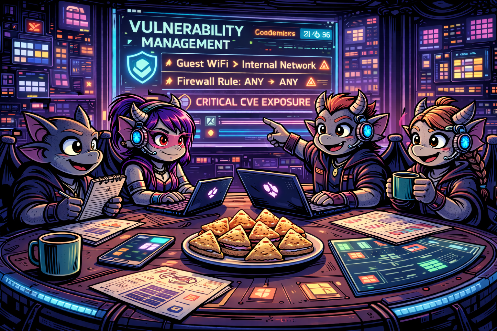

# Vulnerability Management Program Implementation

In this project, I will be simulating the implementation of a comprehensive vulnerability management program, from inception to completion.

_**Inception State:**_ the organization has no existing policy or vulnerability management practices in place.

_**Completion State:**_ a formal policy is enacted, stakeholder buy-in is secured, and a full cycle of organization-wide vulnerability remediation is successfully completed.

# Technology We Are Using
- Azure for our VM (NSG settings, Rule Making)
- Tenable as the Vulnerability Management Platform
- PowerShell & BASH remediation scripts

# Table of Contents
- [STEP 1: Vulnerability Management Policy Draft Creation](#step-1-vulnerability-management-policy-draft-creation)
- [STEP 2: Mock Meeting: Policy Buy-In (Stakeholders)](#step-2-policy-buy-in-stakeholders)
- [STEP 3: Policy Finalization and Senior Leadership Sign-Off](#step-3-policy-finalization-and-senior-leadership-sign-off)
- [STEP 4: Initial Scan Permission (Server Team)](#step-4-initial-scan-permission-w-the-server-team)
- [STEP 5: Initial Scan of Server Team Assets](#step-5-initial-scan-of-server-team-assets)
- [STEP 6: Vulnerability Assessment and Prioritization](#step-6-vulnerability-assessment-and-prioritization)
- [STEP 7: Distributing Remediations to Remediation Teams](#step-7-distributing-remediations-to-remediation-teams)
- [STEP 8: Post-Initial Discovery Scan (Server Team)](#step-8-post-initial-discovery-scan-server-team)
- [STEP 9: Implementing Remediations](#step-9-mock-cab-meeting-implementing-remediations)
- [Remediation Round 1: Outdated Wireshark Removal](#remediation-round-1-outdated-wireshark-removal)
- [Remediation Round 2: Insecure Protocols & Ciphers](#remediation-round-2-insecure-protocols--ciphers)
- [Remediation Round 3: Guest Account Group Membership](#remediation-round-3-guest-account-group-membership)
- [Remediation Round 4: Windows OS Updates](#remediation-round-4-windows-os-updates)
- [First Cycle Remediation Effort Summary](#first-cycle-remediation-effort-summary)

### STEP 1: Vulnerability Management Policy Draft Creation

This phase focuses on drafting a Vulnerability Management Policy as a starting point for stakeholder engagement. The initial draft outlines scope, responsibilities, and remediation timelines, and may be adjusted based on feedback from relevant departments to ensure practical implementation before final approval by upper management.  

**[Draft Policy](DRAFT-imp-vuln-mgmt-prog-POLICY.pdf)**

### STEP 2: Policy Buy-In (Stakeholders)

In this phase, a meeting with the server team introduces the draft Vulnerability Management Policy and assesses their capability to meet remediation timelines. Feedback leads to adjustments, like extending the critical remediation window from 48 hours to one week, ensuring collaborative implementation.

### STEP 3: Policy Finalization and Senior Leadership Sign-Off

After gathering feedback from the server team, the policy is revised, addressing aggressive remediation timelines. With final approval from upper management, the policy now guides the program, ensuring compliance and reference for pushback resolution.  

**[Finalized Policy](https://github.com/ktxor)**

### STEP 4: Initial Scan Permission w/ the Server Team

The team collaborates with the server team to initiate scheduled credential scans. A compromise is reached to scan a single server first, monitoring resource impact, and using just-in-time Active Directory credentials for secure, controlled access.  

### STEP 5: Initial Scan of Server Team Assets

In this phase, an insecure Windows Server is provisioned to simulate the server team's environment. After creating vulnerabilities, an authenticated scan is performed, and the results are exported for future remediation steps.

**[Scan 1 - Initial Scan](https://github.com/ktx0r)**

### STEP 6: Vulnerability Assessment and Prioritization

We assessed vulnerabilities and established a remediation prioritization strategy based on ease of remediation and impact. The following priorities were set:

1. Third Party Software Removal (Wireshark)
2. Windows OS Secure Configuration (Protocols & Ciphers)
3. Windows OS Secure Configuration (Guest Account Group Membership)
4. Windows OS Updates

### STEP 7: Distributing Remediations to Remediation Teams

The server team received remediation scripts and scan reports to address key vulnerabilities. This streamlined their efforts and prepared them for a follow-up review.  

### STEP 8: Post-Initial Discovery Scan (Server Team)

The server team reviewed vulnerability scan results, identifying outdated software, insecure accounts, and deprecated protocols. The remediation packages were prepared for submission to the Change Control Board (CAB).

### STEP 9: Mock CAB Meeting: Implementing Remediations

The Change Control Board (CAB) reviewed and approved the plan to remove insecure protocols and cipher suites. The plan included a rollback script and a tiered deployment approach.

### STEP 10: Remediation Effort

#### Remediation Round 1: Outdated Wireshark Removal

The server team used a **[PowerShell script](remediation-wireshark-uninstall.ps1)** to remove outdated Wireshark. A follow-up scan confirmed successful remediation.

*[Wireshark removal results report](tenable-report-placeholder.pdf)*

#### Remediation Round 2: Insecure Protocols & Ciphers

The server team used PowerShell scripts to remediate insecure protocols and cipher suites. A follow-up scan verified successful remediation, and the results were saved for reference.

**[PowerShell: Insecure Protocols Remediation](toggle-protocols.ps1)**
**[PowerShell: Insecure Ciphers Remediation](toggle-cipher-suites.ps1)**

**[Scan 3 - Ciphersuites and Protocols](tenable-report-space-holder.pdf)**

#### Remediation Round 3: Guest Account Group Membership

The server team removed the guest account from the administrator group. A new scan confirmed remediation, and the results were exported for comparison.  

**[PowerShell: Guest Account Group Membership Remediation](toggle-guest-local-administrators.ps1)**

**[Scan 4 - Guest Account Group Removal](tenable-report-holder.pdf)**

#### Remediation Round 4: Windows OS Updates

Windows updates were re-enabled and applied until the system was fully up to date. A final scan verified the changes  

[scan-results-image](scan-results-image-placeholder.jpeg)

**[Scan 5 - Post Windows Updates](tenable-report-placeholder.pdf)**

---

### First Cycle Remediation Effort Summary

The remediation process reduced total vulnerabilities by 80%, from 30 to 6. Critical vulnerabilities were resolved by the second scan (100%), and high vulnerabilities dropped by 90%. Mediums were reduced by 76%. In an actual production environment, asset criticality would further guide future remediation efforts.  

[img_remediation_graph_reduction](image-vuln-reduct.jpeg)

[Remediation Data](excel sheet link.com)

---

### On-going Vulnerability Management (Maintenance Mode)

After completing the initial remediation cycle, the vulnerability management program transitions into **Maintenance Mode**. This phase ensures that vulnerabilities continue to be managed proactively, keeping systems secure over time. Regular scans, continuous monitoring, and timely remediation are crucial components of this phase. (See [Finalized Policy](vuln_final.pdf) for scanning and remediation cadence requirements.)

Key activities in Maintenance Mode include:
- **Scheduled Vulnerability Scans**: Perform regular scans (e.g., weekly or monthly) to detect new vulnerabilities as systems evolve.
- **Patch Management**: Continuously apply security patches and updates, ensuring no critical vulnerabilities remain unpatched.
- **Remediation Follow-ups**: Address newly identified vulnerabilities promptly, prioritizing based on risk and impact.
- **Policy Review and Updates**: Periodically review the Vulnerability Management Policy to ensure it aligns with the latest security best practices and organizational needs.
- **Audit and Compliance**: Conduct internal audits to ensure compliance with the vulnerability management policy and external regulations.
- **Ongoing Communication with Stakeholders**: Maintain open communication with teams responsible for remediation, ensuring efficient coordination.

By maintaining an active vulnerability management process, organizations can stay ahead of emerging threats and ensure long-term security resilience.
